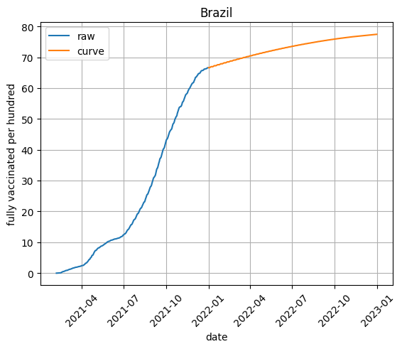

# Vaccination programs

## Introduction
Evaluation of successful vaccination programs is important to combat potential pandemics in the future. Here, the countries were determined where herd immunity against COVID-19 was achieved, hence making these vaccination programs efficient. For this the end-date was predicted when each country can finish making vaccinations by modeling vaccination dinamics with logistic regression.

## Data
Dataframe from Kaggle was used that described COVID-19 World Vaccination Progress. Data was collected across every country and in the continents in general. The population ratio for herd immunity against common viruses including SARS-Cov-2  was found online. 

## Methods
After cleaning the data and visualising the rates of vaccinations in different countries and continents, the vaccinations data was extrapolated and date was predicted when each country can achive herd immunity from COVID-19.

The result of this project is a dataframe containing id the names of the countries and the predicted date when the population is fully vaccinated.

## Results
- The countries that reached the threshold of herd immunity were found.  
    - 19 countries reached herd immunity before 2022
    - 40 countries are expected to reach herd immunity before 2023 
- For those countries that can reach this threshold, the date of the threshold attainment was calculated.    

- The vaccination rates were examined, cleaned and plotted for each country and continent.
- The vaccination trends were obtained. 
    - Two approaches were implemented: sigmoid-like curve fitting and ARIMA.
    - Sigmoid-like curve fitting perfectly explained the historical trend, however was "" for trend prediction
    - ARIMA was perfect for recent data trend extrapolation, however it was impossible to model saturation and trend was linear.
    - Other counties were not analyzed due to lack of data.

- Out of ~200 countries only 59 showed accomplishment of reaching the status of 75% immunized population, which is the lowest threshold for herd immunity for alpha variant of COVID-19.
- Other countries cannot surpass the threshold of herd immunity.

## Example 
Plot of Brazil trend. The model predicts that Brazil will reach heard immunity by 2022-08-24.

